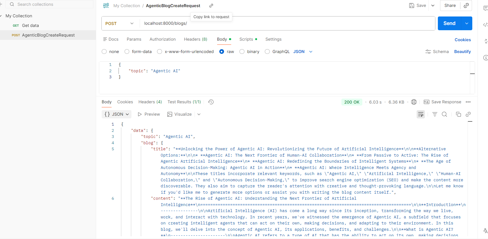
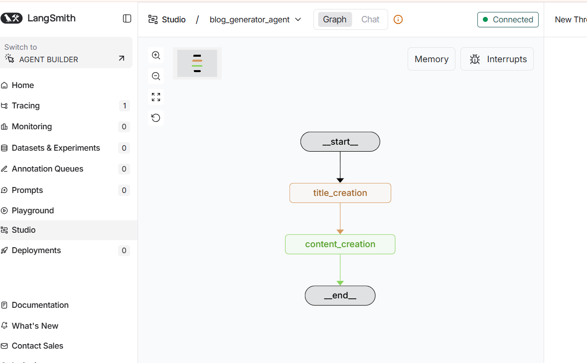
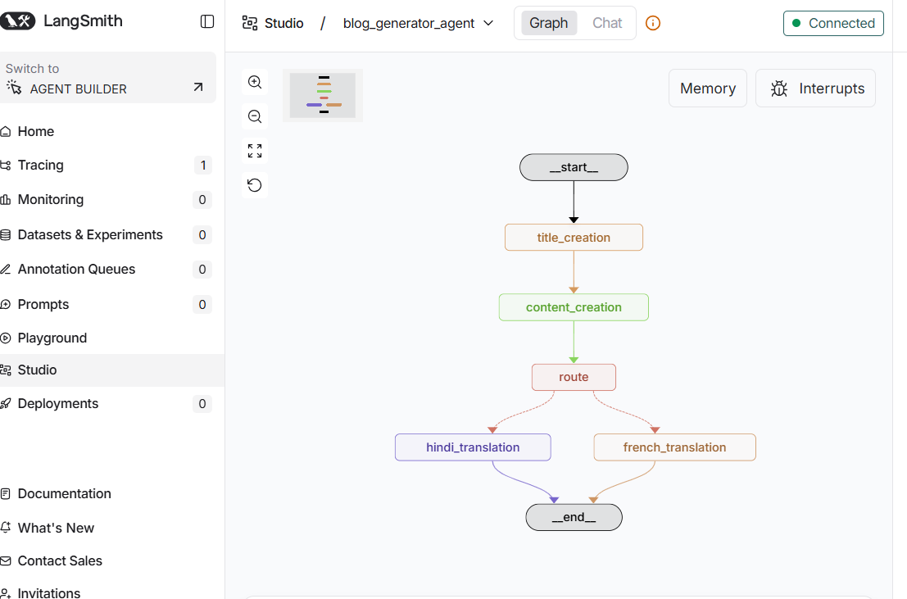
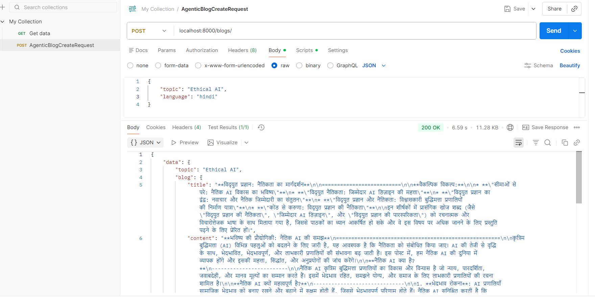
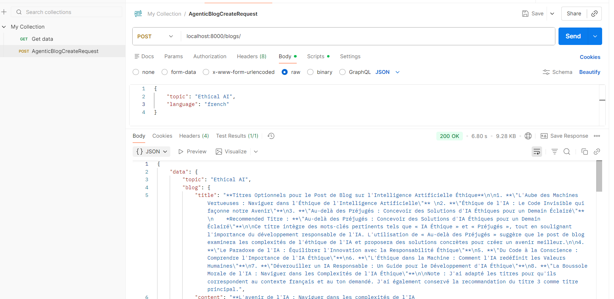

### Setup uv package installer
    Exporing uv package for package installation
    creating venv using uv
    uv init (for initiating the project)
    add the required packages in requirements.txt
    uv add -r requirements.txt
    It may fail if you don't have build tools c++, get it from
    https://visualstudio.microsoft.com/visual-cpp-build-tools/
    This did not work as uv is not compatable with 3.14, so installed 3.13
    Installed 3.13 and added to path, uv init, uv venv, .venv\Scripts\activate
    This resolved uv add -r requirements.txt

### Project folder structure
    create src folder and rest of the folders will be created inside it
    Start with Groq llm model creation
    Then create a graph builder to create entire graph
    Define the states in state.py for information transfer
    Next we define nodes where the actual data generation takes place
    Basically in node we generate the content and pass it as blog to Blog State

### Use Postman to check the end point for Blog creation

### Integrating Langsmith feature
    add the graph to be accessed by langsmith in graph_builder.py
    create langgraph.json and provide path for graph_builder file with graph
    run langchain dev in another terminal with fast api server running in one terminal

    

### Integrating Laguage option (Hindi/French) for Blog creation
    create build_language_graph
    create translation, route and route_decision methods in blog_node
    make changes to graph_builder to show the graph in langsmith
    Here in this graph the current_language is passed using lambda function
    make changes also to get the title conversion too

    langgraph dev gives below image:
    

    Below is the postman api test for results:
    hindi:

    

    french:

    